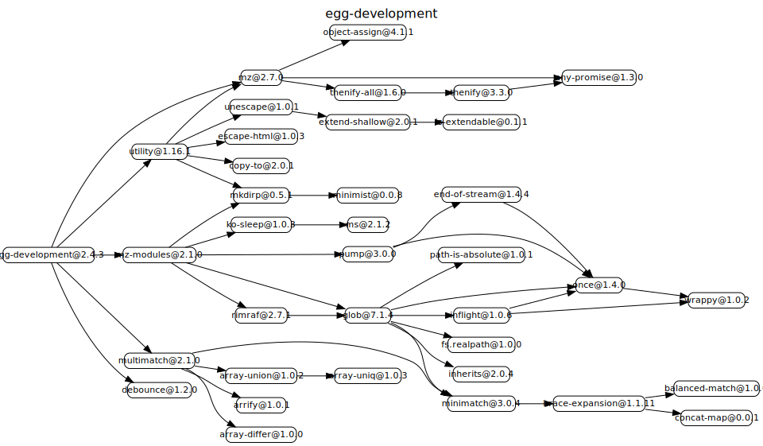

# egg-development

This is an egg plugin for local development, under development environment enabled by default, and closed under other environment.

# 源码分析

__loader_trace__显示追踪调用数据，agent基于egg-watcher模块挂载的ctx.watcher开启文件监听，通过process.send给master进程发消息。app简单的增加中间件。

## 文件结构

``` bash
├── agent.js - 通过egg-watcher来监听文件变化，通过process.send给master发消息。
├── app
|  └── middleware
|     └── egg_loader_trace.js -- 增加中间件，拦截__loader_trace__，响应lib/loader_trace.html信息
├── app.js - 将eggLoaderTrace加到config.coreMiddlewares中
├── config
|  └── config.default.js
├── lib
|  └── loader_trace.html - 追踪数据的模板文件
├── package.json

```

## 外部模块依赖



## 逐个文件分析


## Configuration

see [config/config.default.js](https://github.com/eggjs/egg-development/blob/master/config/config.default.js) for more detail.

## Features

- Under development environment, Output request log in STDOUT, statistic and output all key parts time-consuming;
- Watch file changes, and reload application；

### About Reload

Under the following directory (including subdirectories) will watch file changes under development environment by default, trigger an Egg development environment server reload:

- ${app_root}/app
- ${app_root}/config
- ${app_root}/mocks
- ${app_root}/mocks_proxy

> set `config.development.overrideDefault` to `true` to skip defaults merge.

Under the following directory (including subdirectories) will ignore file changes under development environment by default:

- ${app_root}/app/view
- ${app_root}/app/assets

Developer can use `config.reloadPattern`([multimatch](https://github.com/sindresorhus/multimatch)) to control whether to reload.

```js
// config/config.default.js
exports.development = {
  // don't reload when ts fileChanged
  // https://github.com/sindresorhus/multimatch
  reloadPattern: ['**', '!**/*.ts'],
};
```

### Loader Trace

You can view loader trace for performance issue from `http://127.0.0.1:7001/__loader_trace__`

## Questions & Suggestions

Please open an issue [here](https://github.com/eggjs/egg/issues).

## License

[MIT](https://github.com/eggjs/egg-development/blob/master/LICENSE)
